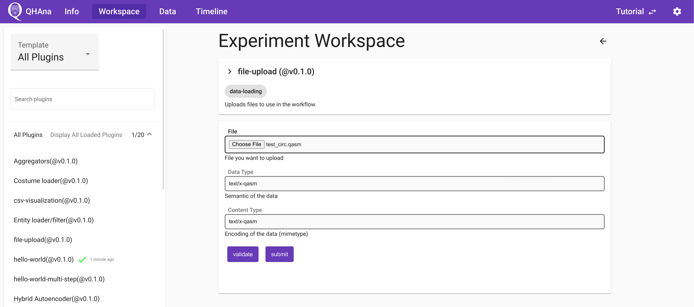

# Using the MUSE dataset

The docker compose setup includes a subset of the MUSE dataset.
This "Mini MUSE" dataset can be used to showcase a more complicated experiment flow.

## Using the Mini MUSE dataset

```{warning}
This workflow description is old and some parts no longer work exactly as escribed in the documents.
```

```{todo}
Update the mini muse workflow description.
```

If you have started QHAna together with the Mini MUSE database, you can take a look at the following documents on how to process the data with the available plugins.

Plugin sequence: {download}`PDF <pdfs/Mini_MUSE_Plugin_Sequence.pdf>`

Tutorial with screenshots: {download}`PDF <pdfs/Mini_MUSE_Plugin_Tutorial.pdf>`

## Using the NISQ-Analyzer plugin

On a fresh start, the "nisq-analyzer" plugin will display no implementations.


To add implementations, you have to run a plugin that produces a `.qasm` file as output.
For example you can follow the "MUSE plugin sequence" mentioned above.
Or you can use the "file-upload" plugin to upload a local `.qasm` file.



The the "nisq-analyzer" plugin will display this implementation and you can use it like the standalone [NISQ-Analyzer](https://github.com/UST-QuAntiL/nisq-analyzer).


