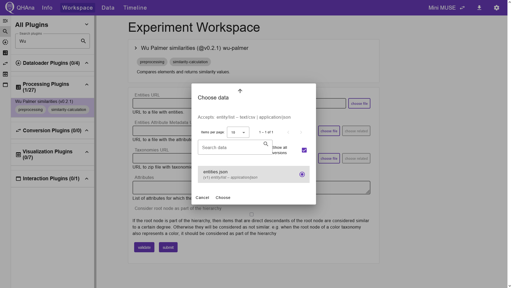

# Using the MUSE dataset

The docker compose setup includes a subset of the MUSE dataset.
This "Mini MUSE" dataset can be used to showcase a more complicated experiment flow.

## Using the Mini MUSE dataset

The MUSE dataset contains a set of movie costumes.
Each entity in the dataset corresponds to a costume.
The attributes of the entity describe the context and the details of the costume.

In this experiment we analyze the costumes of the Mini MUSE dataset.
The goal of this experiment is to calculate clusters of similar costumes and to visualize the clusters in a plot.
This allows us to see patterns and similarities among movie costumes using machine learning.

### Creating the experiment

First navigate to the "Experiments" tab.
Do this by opening the [QHAna UI](http://localhost:8080/#/) or by clicking the QHAna logo in the top left corner.
Create a new experiment by clicking on the "New Experiment" button.
Fill out the dialog and submit it. This will automatically open the new experiment.


### Loading the dataset

To import the Mini MUSE dataset, we use the "Costume Loader" plugin.
Navigate to the "Workspace" tab and select the "Costume Loader" plugin.
Enter the following parameters in the plugin UI:
- DB host: `muse-db`
- DB user name: `test`
- DB password: `test`
- DB database: `KostuemRepo`

Start the plugin by clicking "submit".


After submitting, the QHAna UI shows the experiment step in the "Timeline" tab.
In the overview of the timeline step, we can verify the success of the plugin execution.
Furthermore, in the "Outputs" tab of the timeline step we can inspect plugin output.


### Processing the data

Now that the dataset is successfully imported, we can begin processing the data.
First, we use the "Wu Palmer similarities" plugin to calculate the semantic similarities between the entities of the dataset.
Navigate to the "Workspace" tab and use the search bar to find the "Wu Palmer similarities" plugin.
Select it and choose the previously created files as input for the plugin by clicking the "choose file" button next to the "Entities URL" input field.
This opens a dialog which lists suitable input files.
Select the JSON file containing the entities and click "Choose".
Similarly, we can choose the attribute metadata and the taxonomies of the dataset in the second and third input field.

```{Note}
QHAna plugins exchange data using specific data types and serialization formats.
Each plugin defines the required format for its input and output data.
In the "Choose data" dialog, you can see the accepted format for the chosen input field.
For instance, the "Entities URL" input field of the "Wu Palmer similarities" plugin accepts files of the data type "entity/list", serialized as either JSON or CSV.
When executing a sequence of plugins, ensure that the input data type and serialization format are compatible with the output from the preceding plugins.
Note that we can only run the "Wu Palmer similarities" plugin, because its inputs match the outputs of the previously executed "Costume Loader" plugin.
```



In the "Attributes" input field, enter the list of attributes for which the semantic similarity is to be calculated.

```{tip}
By clicking "show preview" below the "Entities URL" input field, you can open a preview of the entities below the input fields.
You can then scroll down and inspect the JSON file.
Here you can pick and copy attributes for the "Attributes" input field.
```

In this tutorial we use the following attributes:

```bash
dominanteFarbe
dominanterZustand
dominanteCharaktereigenschaft
dominanterAlterseindruck
genre
```


Once all inputs are entered, click "Submit" to start the plugin execution.
The UI then shows the "Timeline" tab, in which we can verify the success of the experiment step.
The plugin output is a ZIP file containing the element similarities.
We can now use the "Sym Max Mean attibute comparer" plugin to calculate the attribute similarities from the element similarities.
Select the plugin in the "Workspace" tab and choose the files of the entities and the element similarities in the corresponding input fields.
In the "Attributes" field, enter the same set of attributes used in the previous plugin.

```{tip}
If you don't remember which attributes you used to calculate the element similarities, you can find out in the "Timeline" tab.
Click the timeline step in which the "Wu Palmer" plugin was executed and switch to the "Inputs" tab.
In this tab you can find a table that lists the chosen input values for the plugin execution.
Here you can copy the value of the "attributes" parameter to reuse it for the next plugins.
```


Start the plugin by clicking "submit".
The output of this plugin is a ZIP file containing the attribute similarities.
In the next step we use the "Similarities to Distances Transformers" plugin to get the attribute distances.
Switch to the "Workspace" tab and select the plugin.
Choose the file that contains the attribute similarities in the corresponding input field.
In the "Attributes" field, enter the same set of attributes once again.
In the "Transformer" field, we will keep the default option "Linear Inverse".


After successful plugin execution, we have the attribute distances.
We can now use the "Aggregators" plugin to calculate the entity distances.
Select the plugin and choose the file containing the attribute distances in the input field.
We keep the default options for the remaining two input fields.


Upon submission, the plugin will generate a JSON file which contains the entity distances.
The entity distances can be converted to points in space using the "Multidimensional Scaling (MDS)" plugin.
Select the plugin in the Experiment Workspace and choose the file that contains the entity distances in the corresponding input field.
For the remaining input fields, we keep the default options.


After submitting, the plugin creates a JSON file containing the calculated entity points.
We can already inspect the results by switching to the "Outputs" tab in the timeline step.
In the "Preview With:" field, select "Clustered Scatter Plot Visualization" to visualize the entity points.
Note that results may vary, as MDS is not deterministic.


Now the preprocessing is done and we can use a clustering plugin to group the data points.

```{tip}
In the "Workspace" tab, the search bar can also be used to search for plugins with certain plugin tags.
For instance, you can enter "clustering" to filter for clustering plugins.
```

For this tutorial we choose the "Classical k Means" plugin.
Choose the file containing the entity points as an input.
Tick the "Visualize" box to generate an HTML file displaying the clustered data.
Submitting creates two files:
The HTML file to visualize the clusters and a JSON file containing cluster labels for each entity.


### Visualizing the results

We now finished processing the data and can visualize the results.
Switch to the "Outputs" tab of the timeline step.
Here we can see the two created output files.
The first file is the JSON file containing the entity point labels.
We can visualize the clustered entity points by selecting "Clustered Scatter Plot Visualization" in the "Preview With:" field.
This will open a plugin interface below the title of the JSON file.
Choose the corresponding set of entity points in the "Entity Point URL" field of the plugin interface.
After choosing the file, the plugin interface will automatically show a preview of the clustered entity points.
Note that this way of visualizing the results can always be done, even when the "Visualize" box is not ticked in the respective processing step.


Below the JSON file, we can see an HTML file that visualizes the clustered data points.
Note that this HTML file only gets generated when the "Vizualize" box is ticked in the processing step.
With this file, we can export the visualized data as an HTML file or as a PNG.
Click the title of the HTML file to open the output details page.


To export the plot, click "Download as File".
This will open a seperate tab in your browser in which the plot is displayed.
Clicking the small camera icon in the menu on the top right will download the plot as a PNG.
Alternatively, you can download that page as an HTML.


```{Note}
As an alternative to using visualization plugins in the "Outputs" tab, we can select a visualization plugin in the workspace and use it to process the results.
Submitting a visualization plugin with a set of data points and their corresponding labels will generate an HTML file, which will be stored in the Experiment Data tab.
Note that this is usually not necessary, as you can already generate such an HTML file by ticking the "Visualize" box in the final processing step.
```

### Processing data multiple times

We can generate different results by processing the same data another time.
Now we use the "Classical k Medoids" plugin to process the same entity points once again.
To generate three clusters this time, change the parameter "Number of Clusters" to 3.
Once again, tick the "Visualize" box to generate an HTML file in addition to the entity labels.


After submitting, switch to the "Outputs" tab and scroll down to see a preview of the result.


## Using the NISQ-Analyzer plugin

On a fresh start, the "nisq-analyzer" plugin will display no implementations.


To add implementations, you have to run a plugin that produces a `.qasm` file as output.
For example you can follow the "MUSE plugin sequence" mentioned above.
Or you can use the "file-upload" plugin to upload a local `.qasm` file.


The the "nisq-analyzer" plugin will display this implementation and you can use it like the standalone [NISQ-Analyzer](https://github.com/UST-QuAntiL/nisq-analyzer).


