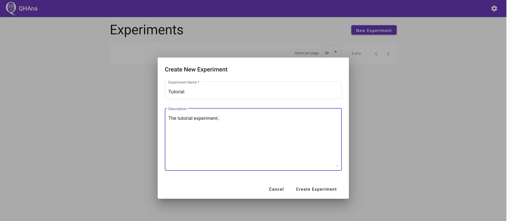
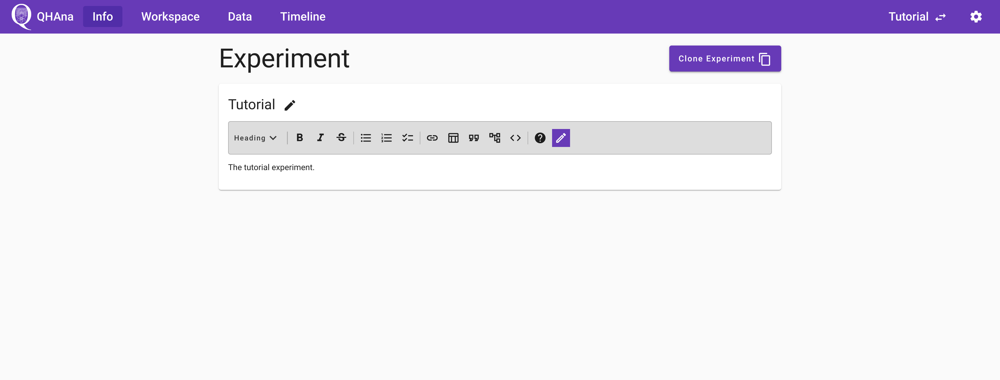
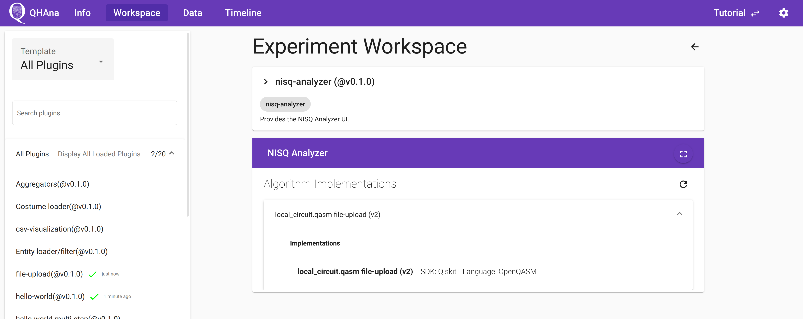

# Quick Start

To use QHAna locally, there are a few requirements to consider:

1. A working installation of `docker compose` (see <https://docs.docker.com/compose/install/>)
2. Enough free RAM (about 6GB should work for most experiments)
3. Enough free disk space (10GB should be enough)
4. A good internet connection

To start qhana locally, clone (or download) the `qhana-docker` repository and use the command `docker compose up` in a terminal.
The command must be run in the folder that contains the {file}`docker-compose.yml` file.

```{attention}
The **first start** will take a considerable amount of time before everything is up and running.
This is because the plugin runner containers download the plugins and their requirements on the first start.
It can take around **10 to 15 minutes** to install the plugins requirements in the default configuration.
Keep an eye on the output in the terminal.
```

To stop the running containers again focus the terminal and use {kbd}`strg+c` (or {kbd}`ctrl+c` on a mac) to stop the containers.
This may not stop them immediately but should happen fairly quickly.

```{hint}
To start the docker compose setup without having to keep the terminal window open, add a `-d` at the end of the command.

`docker compose up -d`

When started like this, use the command `docker compose down` to stop the containers.
```


## Settings

After starting the docker compose file and waiting for the containers to start, verify that everything is setup correctly in the settings page.
Open the QHAna UI <http://localhost:8080> and go to the settings page by clicking on the gear icon in the top right corner or directly opening <http://localhost:8080/#/settings> in the browser.

If the plugin registry is running on a different port or on another host, then first change the plugin registry URL.
The default value of `http://localhost:5000/api/` can be restored by updating the URL with empty values.

Once the plugin registry is up and running, the "Services" card should show the URL `http://localhost:9090` for the QHAna Backend service.
If the backend has a different address, then click on "all services" and edit the URL.

The plugin runner URL should appear in the "Plugin Seed URLs" card as `http://localhost:5005/`.
If the plugin runner is using a different URL, then add that URL to the list.
Seed URLs can also directly point to QHAna plugins for plugins that are not running in a plugin runner.


Navigate back by using the browser history or clicking on the QHAna logo in the top left corner.

```{hint}
If the plugin registry is working, but the QHAna UI refuses to connect, first check if the registry can be reached from your browser by accessing it directly using its URL.
Second, check if the plugin registry URL in the settings is actually correct and reset this setting to default if required.
```


## The First Experiment

First create a new experiment by clicking on the "New Experiment" button and filling out the dialog.
Submitting the dialog will automatically open the new experiment.



The currently selected experiment name is always shown in the top right corner.
To select a different experiment use the "Change Experiment" button in the "Info" tab (or click on the QHAna logo) and select another experiment from the list of experiments.

The experiment description and title can be changed any time.
The description supports markdown formatting including LaTeX math formulas and support for [mermaid.js](https://mermaid-js.github.io/mermaid/#/?id=diagram-types) diagrams.
The question mark icon in the top right corner of a markdown editor brings up a quick help for using the markdown editor.



### Using Plugins

To use a plugin open the "Workspace" tab of the experiment.
The default template will be selected, which is the "All Plugins" template.
It displays all plugins unstructered on the left.

Templates can be used to give structure to the plugins on the left, by grouping them into categories.
If you want to define your own templates, please read about it in the [QHAna Plugin Runner Documentation](https://qhana-plugin-runner.readthedocs.io/en/latest/templates.html).


For this tutorial, the "Hello World" template is perfect.
To choose it, click on the selected "All Plugins" template and choose the "Hello World" template from the drop down menu.


The list of all available plugins of this template can be found on the left.
If no plugin shows up, make sure that the plugin runner is running and configured in the setting spage of the QHAna UI (see [Settings](#settings)).
Select a plugin by clicking on its name in the list.


At the top of the workspace is the detailed plugin description.
The second card is the user interface of the plugin.
Different plugins can have different inputs.
For this tutorial we will be using the "hello world" plugin and input the text ``Tutorial input string.``.
The inputs can be validated with the "validate" button.
The "hello world" plugin accepts almost any input, but other plugins have stricter requirements.
Start the plugin by clicking on "submit".

On a successfull submit the QHAna UI shows the recorded experiment step and automaticallly polls for the finished results.
Once the results are available the UI will show the outputs generated by the plugin in the open timeline step.


The finished timeline step can be supplemented with notes supporting markdown.
The notes are automatically saved while typing.
The quality of the computed result can be recorded with the special "Result Quality" field.

In the "Output" tab of the timeline step, the output of the "hello world" plugin is shown.
Every occurrence of "in" was replaced by "out".


The title of the output directly links to the produced output data details page.
The page contains a download link and a preview.
It also lists in which step the data was produced in and which steps use this data as input.


The data can also be found by navigating to the data tab and opening the specific data.
The produced data is sorted with the newest data at the top.
Data with the same filename creates new versions.


The timeline tab contains the whole list of timeline steps.
It is ordered by ascending step number, meaning that the first step is at the top.


## Using the Mini MUSE dataset

If you have started QHAna together with the Mini MUSE database, you can take a look at the following documents on how to process the data with the available plugins.

Plugin sequence: {download}`PDF <pdfs/Mini_MUSE_Plugin_Sequence.pdf>`

Tutorial with screenshots: {download}`PDF <pdfs/Mini_MUSE_Plugin_Tutorial.pdf>`

## Using the NISQ-Analyzer plugin

On a fresh start, the "nisq-analyzer" plugin will display no implementations.


To add implementations, you have to run a plugin that produces a `.qasm` file as output.
For example you can follow the "MUSE plugin sequence" mentioned above.
Or you can use the "file-upload" plugin to upload a local `.qasm` file.


The the "nisq-analyzer" plugin will display this implementation and you can use it like the standalone [NISQ-Analyzer](https://github.com/UST-QuAntiL/nisq-analyzer).



## Next Steps

```{todo}
Describe and link to next steps
```
