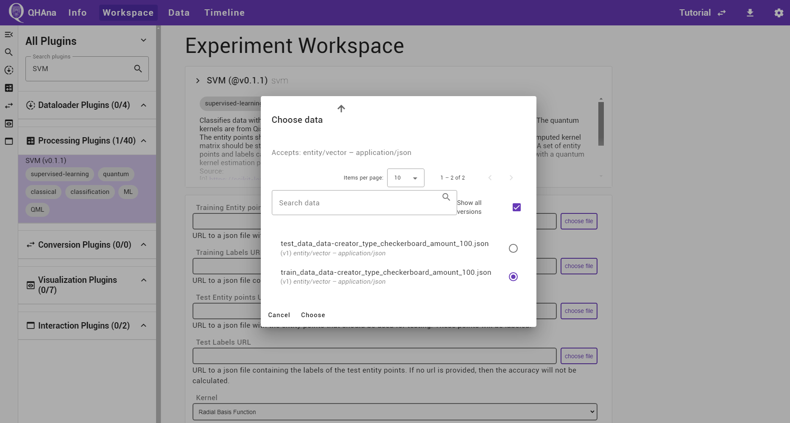

# Quick Start

To use QHAna locally, there are a few requirements to consider:

1. A working installation of `docker compose` (see <https://docs.docker.com/compose/install/>)
2. Enough free RAM (about 6GB should work for most experiments)
3. Enough free disk space (10GB should be enough)
4. A good internet connection

To start qhana locally, clone (or download) the `qhana-docker` repository and use the command `docker compose up` in a terminal.
The command must be run in the folder that contains the {file}`docker-compose.yml` file.

```{attention}
The **first start** will take a considerable amount of time before everything is up and running.
This is because the plugin runner containers download the plugins and their requirements on the first start.
It can take around **10 to 15 minutes** to install the plugins requirements in the default configuration.
Keep an eye on the output in the terminal.
```

To stop the running containers again focus the terminal and use {kbd}`strg+c` (or {kbd}`ctrl+c` on a mac) to stop the containers.
This may not stop them immediately but should happen fairly quickly.

```{hint}
To start the docker compose setup without having to keep the terminal window open, add a `-d` at the end of the command.

`docker compose up -d`

When started like this, use the command `docker compose down` to stop the containers.
```


## Settings

After starting the docker compose file and waiting for the containers to start, verify that everything is setup correctly in the settings page.
Open the QHAna UI <http://localhost:8080> and go to the settings page by clicking on the gear icon in the top right corner or directly opening <http://localhost:8080/#/settings> in the browser.

If the plugin registry is running on a different port or on another host, then first change the plugin registry URL.
The default value of `http://localhost:5000/api/` can be restored by updating the URL with empty values.

```{hint}
Troubleshooting the connection to the plugin registry:

1. Check if the registry can be reached from your browser by accessing it directly using its URL.
2. Check if the plugin registry URL displayed in the settings is actually correct (the same as the URL that works in 1.) and reset this setting to default if required.
```

Once the plugin registry is up and running, the "Services" card should show the URL `http://localhost:9090` for the QHAna Backend service.
If the backend has a different address, then click on "all services" and edit the URL.

The plugin runner URL should appear in the "Plugin Seed URLs" card as `http://localhost:5005/`.
If the plugin runner is using a different URL, then add that URL to the list.
Seed URLs can also directly point to QHAna plugins for plugins that are not running in a plugin runner.


Navigate back by using the browser history or clicking on the QHAna logo in the top left corner.


## The First Experiment

```{tip}
In QHAna everything is organized in experiments.
A QHAna experiment contains the data that is to be examined using QHAna, all results of that examination as well as a record of every step of the examination.
```

First create a new experiment by clicking on the "New Experiment" button and filling out the dialog.
Submitting the dialog will automatically open the new experiment.


The currently selected experiment name is always shown in the top right corner.
To select a different experiment use the "Change Experiment" button in the "Info" tab (or click on the QHAna logo) and select another experiment from the list of experiments.

The experiment description and title can be changed any time.
The description supports markdown formatting including LaTeX math formulas and support for [mermaid.js](https://mermaid-js.github.io/mermaid/#/?id=diagram-types) diagrams.
The question mark icon in the top right corner of a markdown editor brings up a quick help for using the markdown editor.


### Using Plugins

```{tip}
The main working area of an experiment is the experiment workspace.
It contains a list of data processors – the plugins – to work with the data.
To get data into the workspace, use a plugin that imports/loads data from an external source.
```

To use a plugin open the "Workspace" tab of the experiment.
On the left side of the Workspace is the plugin sidebar.
It shows all currenlty available plugins.
The plugins can be grouped into different groups.
By default they will be grouped by their function.
If the default grouping is active, the top of the sidebar will read "All Plugins".
The list of plugins can be searched using the provided search box at the top.
If a single group contains more than 25 plugins, then use the "load more" button at the end of the list to load additional plugins from that group.


```{hint}
Troubleshooting the plugin sidebar:

1. Check if the correct ui template is selected at the top. Select the default "All Plugins" template by clicking at the top of the sidebar and selecting the "show all plugins" option.
2. Check the [settings page](#settings), in particular the plugin registry URL and the seed URLs.
3. Check if the listed seed URLs are reachable from your browser.
4. Wait a bit. The first start of the containers can take a while (see notice at the top of this document). Once all containers are up and running, the plugin registry can still take about 60s (the default settings in the docker-compose file) to discover the newly available plugins.
5. Check the docker compose logs of the plugin runner and the plugin registry worker containers (and make sure that all containers are fully running).
```

At first, a plugin that loads data into the experiment is required.
Select the "Data Creation" plugin in the "Dataloader Plugins" group by clicking on it.
The workspace now shows a description of the plugin at the top followed by the plugin UI.


At the top of the workspace is the detailed plugin description.
If the description is longer, than it can be expanded by clicking on the plugin title.
The second card is the user interface of the plugin.
Different plugins can have different inputs.


#### Loading Data

For this tutorial we will be using the "Data Creation" plugin to create a synthetic "Checkerboard" dataset with 100 training points and 100 test points.
Select the "Data Creation" plugin in the "Dataloader Plugins" group by clicking on it.
Enter the required parameters in the plugin UI as shown in the next screenshot.
Start the plugin by clicking on "submit".


On a successfull submit the QHAna UI shows the recorded experiment step and automaticallly polls for the finished results.
Once the results are available the UI will show the outputs generated by the plugin in the open timeline step.


The finished timeline step can be supplemented with notes supporting markdown.
The notes are automatically saved while typing.
The quality of the computed result can be recorded with the special "Result Quality" field in the timeline step overview.

In the "Output" tab of the timeline step, the output of the plugin is shown.
Two datasets, one for training and one for testing out the training results, have been created, both with points given as 2D coordinates and cluster labels in separate outputs.

In most cases, a preview shows up for the data.
In some cases, multiple different preview options are available.
The different options can be selected using the dropdown to the right of the output name.
Some previews are provided by plugins.
Those can have additional options that may be hidden in the "Visualization Options" at the top of the preview.


The title of the output directly links to the produced output data details page.
The page contains a download link and a preview.
It also lists in which step the data was produced in and which steps use this data as input.


The data can also be found by navigating to the data tab and opening the specific data.
The produced data is sorted with the newest data at the top.
Data with the same filename creates new versions.


The timeline tab contains the whole list of timeline steps.
It is ordered by ascending step number, meaning that the first step is at the top.


#### Processing Data

The next step is to further process the data in the experiment.
First, go back to the experiment workspace and select the "SVM" plugin from the "processing Plugins" group.
Use the search box to quickly find the plugin.

To select data from the current experiment use the "choose file" buttons in the plugin UI.
A dialog will pop up containing all data that can be used for the specific form input.
First select the training data and labels for the first two fields, then select the test data and labels for the third and fourth field.



For this tutorial, we will choose the linear kernel function and leave the other parameters on their default setting.
The box for visualization should be checked.


Once data is selected, a preview of that data will appear below the plugin UI.
Only one preview can be active at the same time.
To preview different data, use the "show preview" buttons below the data input form fields.

This time the calculation may take a bit longer than for the first plugin.
Once the plugin is finished, check the outputs tab of the timeline step.
It should contain a visualization like in the next figure.


```{tip}
The tutorial experiment can also be imported into your QHAna instance.

1. Download the experiment {download}`Tutorial.zip <experiments/Tutorial.zip>`.
2. Go to the experiments overview page.
3. Click on "import" and select the downloaded file from 1.
4. Optionally rename the imported experiment, if you already have a "Tutarial" experiment.
```


## Next Steps

A more complicated experiment demonstrating the capabilities of QHAna can be found in {doc}`muse`.

{doc}`docker-compose` contains a detailed description of the containers defined in the docker-compose file.
It also contains an overview of the network connectivity for troubleshooting.
