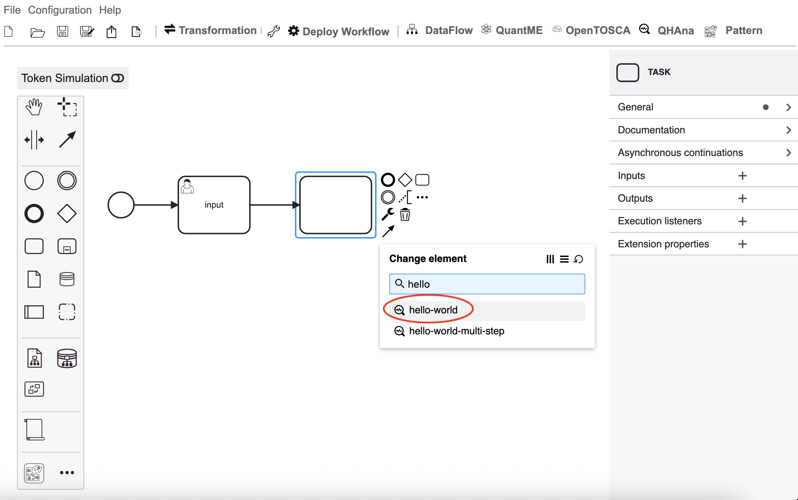

# Workflows

This tutorial will demonstrate how to model a simple workflow containing a QHAna plugin, deploy it as a plugin, and execute it.

## Workflow Editor

First, open the "Workflow Editor" plugin. Without anything selected, open the "General" category on the right-side panel and enter a name for the workflow. 

Next, click on the QHAna button and then on "Update Configurations" to update the list of plugins available as QHAna service tasks.

Then, click on the start node and select the three-dot menu.

Search for "User Task" and select it. This creates a task where the user can enter input for the following plugins.

Optionally, enter a name for this task.

Select the user task and click on the three-dot menu.

Select "Task" to create a new task after the current one.

Click the wrench icon.

You can either search for the plugin name or navigate through the list "QHAna Tasks" -> "QHAna Service Tasks".
Select the "hello-world" plugin to convert this task to the QHAna service task for the "hello-world" plugin.
You could also use the "CUSTOM" QHAna service task and enter the details manually.

Click on the hello-world task and on the thick circle to add the end node.

Now, we will configure the tasks. Select the user input task and select the "Generated Task Forms" type in the forms category.

In the "Form fields" category, click on the plus to create a new field and add as ID "qouput.inputHelloWorld".
For QHAna tasks the "qouput." prefix is used for all process variables that will contain the output value of said QHAna task.
For the form we define here, however, it is not necessary, but we use it for consistency.

Click on the hello-world task and add an input with the plus icon. Use "qinput.inputStr" as the local variable name. "qinput." is the prefix for all plugin input variables, and "inputStr" is the name of the plugin input and must be equal to one of the plugin parameter names. Choose "Map" as the assignment type and add a new map entry. Use "qouput.inputHelloWorld" and "plain" as value. This will map the output variable of the user task to the input of the hello-world task and therefore forward the user input to the hello-world plugin.

Add an output with "result.qoutput.helloWorldResult" as process variable name. The prefix "result." marks this variable as a workflow result and ".qoutput" as QHAna plugin output. Select "String or expression" as assignment type and "${output}" as value to assign the output of the plugin to the process variable.

To transform this workflow into an executable workflow, click on the wrench icon to the right of the "Transformation" button and make sure only "DataFlow Transformation" and "QHAna Transformation" are active.
After the transformation the name of the workflow is appended with "_transformed" to indicated that it was already transformed, but you can change the name as shown in the beginning.

Click on "Transformation" and you will get the shown workflow as result.

This transformation will add an unnecessary output to the hello-world task that must be removed, otherwise, it will result in an error during execution.

Now, we will deploy the workflow as a plugin by clicking on "Deploy Workflow" and "Deploy as Plugin."

### Excursion: File outputs from previous steps as input

If a step has produced a file as output and you want to use it as input for a later step as input you have to create a input with "Map" assignment type.
In the map entries you have to specify a "from" key to define from which process variable you want the output file.
Then you can use multiple filters to specify which file exactly you want if the process variable contains multiple files.
You can filter by file name if you add a "name" key and add the name as value.
This filter supports glob notation e.g. you can use "*" to indicate zero or more arbitrary characters.
To filter by data type you can add a "dataType" key and add the data type as value.
The same applies to "contentType".

## Workflow Plugin

Go back to the experiment workspace to find the plugin with your chosen workflow name and the suffix "_transformed" (if you didn't change it) in the plugin list and click on "submit" to execute the workflow.

Now, wait until the "User Input" task is executed. You will be prompted to input text. When done, click "submit."

When the workflow has finished, you will see "SUCCESS" as the status.

